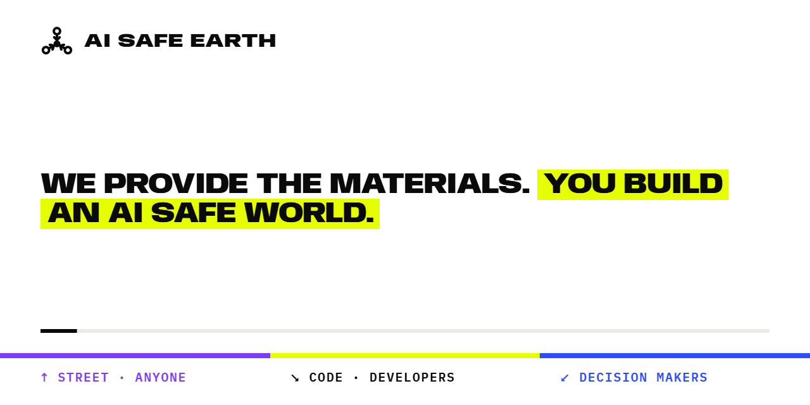
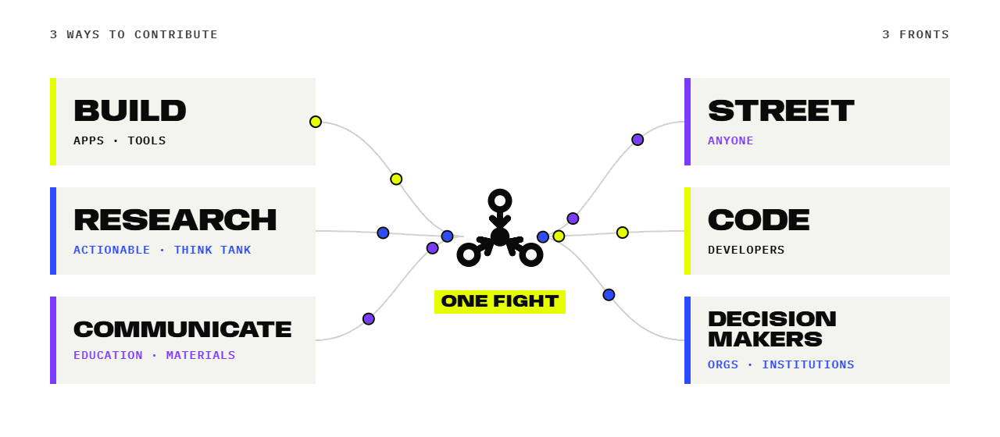
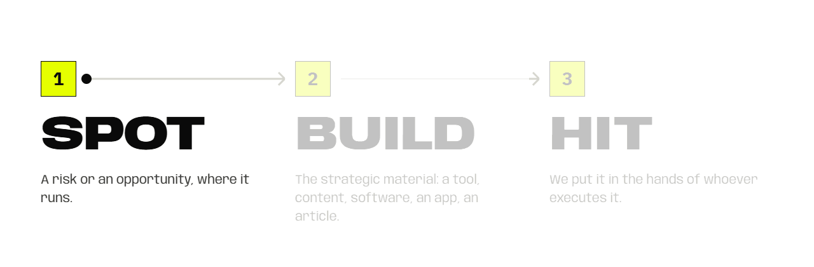
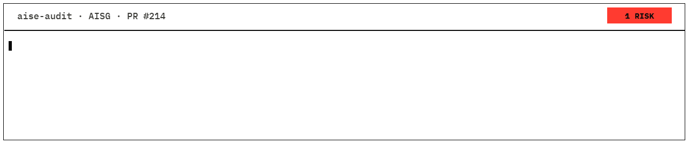

## AI safety integral strategy

**Social infrastructure is critical infrastructure.**
**AI safety begins where humans meet.**
**At AI SAFE EARTH, we ACT.**

AI SAFE EARTH was born as a response to digital imbalance, under one critical assumption: as digital systems grow more intelligent, that imbalance amplifies disruptive social risks. We are an open umbrella for people who don't just theorize about this. They build, research and communicate to change it. AI SAFE EARTH is open to any ethical AI initiative and ready to pivot if the times require it.

---

## The problem we refuse to ignore

A digital intermediate layer is thickening between human connections, and the models and agents that manage those connections become more powerful every day. When a single layer mediates how people talk, decide and relate, whoever controls it gains outsized power, and communities lose agency.

The risk is not a distant superintelligence. It has already begun: the slow erosion of human agency and the concentration of power.

Some forecasts put transformative AI in years, not decades. We may be unprepared for the effects, and we cannot wait for perfect research or perfect policy. So we treat social infrastructure the way we treat a power grid: as critical infrastructure to be protected and strengthened, urgently, before digital imbalance and advanced AI combine into something we cannot undo.

---

## Three fronts. One fight.

| Front | Who | What they can do |
|---|---|---|
| **STREET** | anyone: individuals, community and association leaders | take training, organise training sessions, report apps and sites, bring proposals to their town, neighbourhood or community, join the network, spread the word |
| **CODE** | developers and engineers | audit any repository that uses AI, contribute fixes, make software AI safe |
| **DECISION MAKERS** | local administrations, organisations, institutions | audit their own administration, support AI safety initiatives, train public employees and inform the population |

**Strategic focus: act on the community layer, at scale.** Communities are where AI risk lands and where it can be stopped, so every front works through them.

AI SAFE EARTH builds the materials each of these actions needs, simple and ready to apply.

---

## How we move

**1 · SPOT** a risk or an opportunity.
**2 · BUILD** the strategic material: a tool, content, software, an app, an article.
**3 · HIT.** We put it in the hands of whoever executes it.

This is how we act. Direct.

---

## Goal

- A population informed about AI risks. 
- A population using AI safe apps. 
- A population connected, informed and ready to respond to any kind of AI risk.
- An active army of coders fixing software that isn't AI safe.
- A non-individualised population: people connected, not isolated users.
- Communities as the core social node.

---

## Contribute: three ways, one goal

Contributors build the apps, tools, research and materials that everyone else uses.

---

## BUILD

This is the action arm. We build safe apps that rebalance digital and physical social interaction and reinforce local communities and social dynamics. Physical and local networks are the safety net. Social infrastructure is critical infrastructure, and we build to make it stronger, fast, before AGI, malicious actors using AI and digital imbalance create a critical combination.

Two lines of work:

1. **Applications for a resilient territory.** They promote physical, direct interaction: human to human, human to nature, human to organisation. They put people in touch and leave the communication itself without AI as an intermediate layer. Keeping that layer out is how we keep human agency.
2. **Tools that make any software AI safe.** Skills, packages and repos that can be applied to any other codebase that uses AI.

### Applications for a resilient territory

##### How we think about applying AI

We apply AI to turn the algorithmic loop into a bridge toward real life. We don't use AI as an addictive form of interaction. We use it to bring people back to people, pulling users out of infinite scrolling and dopamine drain and into face-to-face socialising and public life. We return data ownership to users and keep it secure to prevent deep manipulation.

##### Why

Because it is too risky to rely on a digital network whose control could be captured.
Because AI safety begins where humans meet.

**At AI SAFE EARTH, we:**

- Use AI to reconnect, not to trap.
- Treat physical networks and communities as a resilience layer for a healthy system.
- Keep humans, cultures and communities at the centre.
- Keep AI out of the layer between people.
- Build tools for balance, not distraction.

**We don't:**

- Build artificial companions.
- Optimise for engagement or addiction.
- Replace real relationships with simulation.
- Sell people's lives or intimacies in any data format.

#### [laiive](https://github.com/ai-safe-earth/laiive)

     

The first project under the AI SAFE EARTH umbrella: a global cultural agenda that connects people with live music, in the room. Some of the services built behind laiive are being developed project-agnostic, so other projects can use them to extend AI SAFE EARTH's values.

#### [VaiVia](https://github.com/ai-safe-earth/VaiVia)

     

VaiVia connects people with trails, hikes and outdoor routes through a knowledge graph that answers complex natural-language queries, pulling users away from the screen and into the physical world.

### Tools to make any AI software safe

#### [AISG: AI Safety Guardrails & Audit](https://github.com/ai-safe-earth/AI-Safety-Guardrails)

     

A tool that applies to any piece of software using AI, in two parts:

- **Audit:** a skill and toolset that reviews any repository using AI, maps the system, checks it against a safety and good-practice list (human oversight, data, robustness, transparency, EU AI Act, GDPR), and proposes the fixes as a pull request.
- **Guardrails:** a modular package that adds layered protection around LLM applications at four stages: input, processing and tool calls, output, and policy and compliance. It reduces risks such as PII leakage, prompt injection, unsafe tool use and harmful responses before they reach users. Audit logging and compliance modules (EU AI Act, NIST AI RMF) provide traceability and governance for real-world deployment.

#### AI safety compilation *(open)*

 

A compilation of open tools that coders can apply to make software AI safe.

#### Prompt and algorithm audits *(open)*

 

Audits of the prompts behind AI products. They look for:

- manipulation;
- user information used to create addiction;
- any trace of attention-economy algorithms;
- persona substitution: the borderline where a chat turns into a fake person.

---

## RESEARCH

We study how to build an AI safe earth from the community perspective, with an integral approach focused on systems that are resilient, or vulnerable, to the erosion of human agency: legal frameworks, identifying situations, parametrising and mapping. Every piece of research is actionable, or it feeds the think tank.

### [AI Safe Territory](https://github.com/ai-safe-earth/AI-Safe-Territory) *(in progress)*

     

Research into AI-safe towns and cities, and a transparent, reproducible evaluation system that scores and ranks territories on their resilience: distributed decision-making, redundant communication channels (no single point of dependence), local ownership, civic density, AI literacy, and exposure to capture.

The research is published and evolving as a [living book](https://ai-safe-earth.github.io/AI-Safe-Territory/).

### AI Safe Map *(open)*

 

A map of AI risks and of exposure to them. It works at territorial grain, not country grain, so it sits closer to the impact on each community.

---

## COMMUNICATE

We turn research into pressure. This branch creates the materials for AI safety education, in many kinds of programmes and formats. It gives research a punchy shape and supports any action with communication. Using data, real examples and red-teaming scenarios, we build critical mass and move decision-makers to act. We find the gaps between AI risks and people's awareness of them, and close them with effective AI safety literacy.

### AI Safety for Community Leaders *(in progress)*

 

Practical, accessible programmes and materials for the local leaders who hold communities together. They are ready to use in a training session, a meeting or a proposal to a local administration.

### AI adoption for SMEs and micro businesses: the SAFE way *(open)*

 

Materials that help small and medium enterprises (SMEs) and micro businesses adopt AI the safe way.

---

## Contributing

Build, research or communicate. Start with [contributing](./contributing.md), pick an `OPEN` badge above, or [open an issue](https://github.com/ai-safe-earth/.github/issues) and tell us what you want to do.

---

AI SAFE EARTH · build · research · communicate · spot, build, hit · <a href="https://github.com/ai-safe-earth">github.com/ai-safe-earth</a>
