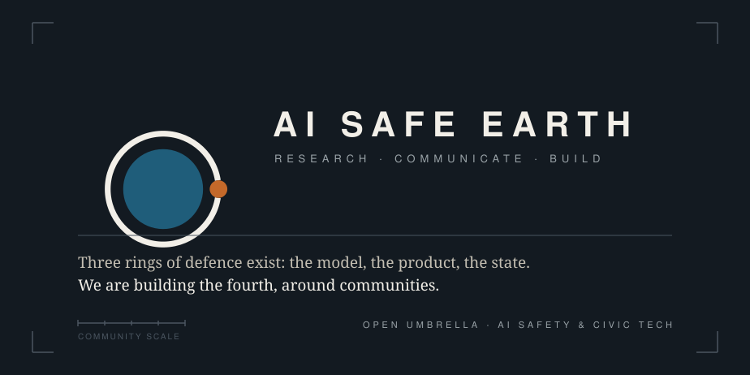

## AI safety begins where humans meet

**Social infrastructure is critical infrastructure.**

Three rings of defence around artificial intelligence already exist. AI SAFE EARTH
proposes the fourth.

| | Ring | Who builds it |
|---|---|---|
| 1 | Around the model | alignment, interpretability, evals |
| 2 | Around the product | regulation, compliance |
| 3 | Around states | summits, institutes, treaties |
| **4** | **Around communities** | **ours, and unbuilt** |

The gap is the work, and the invitation.

---

## The problem we refuse to ignore

A digital intermediate layer is thickening between human connections, and the models and
agents that manage those connections grow more powerful every day. When a single layer
mediates how people talk, decide, and relate, whoever controls it gains outsized power,
and communities lose agency.

The risk is not a distant superintelligence. It has already begun: the slow erosion of
human agency and the concentration of power.

Some forecasts put transformative AI in years, not decades. We cannot wait for perfect
research or perfect policy. So we treat social infrastructure the way we treat a power
grid — as critical infrastructure to be protected and strengthened, urgently, before
digital imbalance and advanced AI combine into something we cannot undo.

---

## Three pillars

**RESEARCH** — We study AI safety with an integral approach, focused on which systems
are resilient to the erosion of human agency and which are vulnerable.

**COMMUNICATE** — We turn research into pressure. Using data, real examples and
red-teaming scenarios, we build critical mass and move decision-makers to act. We
identify the gaps between AI risks and public awareness, and we make materials that
close them.

**BUILD** — We build to rebalance digital and physical social life, to reinforce local
communities, and to return data ownership to people. Alongside this we develop technical
safety layers for AI applications.

---

## Projects

Each project is a place on the map. The earth and the ring never change — they are the
organization. Only the point moves, because a project is always somewhere.

| Project | | Pillar · Stage |
|---|---|---|
| [**AI Safe Territory**](https://github.com/ai-safe-earth/AI-Safe-Territory) | Is this place resilient? Six factors, one index, a falsifiable prediction. | RESEARCH · IN PROGRESS |
| [**laiive**](https://github.com/ai-safe-earth/laiive) | Live music, in the room. Pulls people off the scroll and into the same building. | BUILD · GOING TO MARKET |
| [**Safety Guardrails**](https://github.com/ai-safe-earth/AI-Safety-Guardrails) | Defence in depth for LLM applications: input, tools, output, policy. | BUILD · EARLY STAGE |
| [**get-out-door**](https://github.com/ai-safe-earth/get-out-door) | Trails, hikes and routes through a knowledge graph — screen to physical world. | BUILD · IN DEVELOPMENT |
| [**UDO**](https://github.com/ai-safe-earth/UDO) | User data ownership. No black box builds your vector without you. | BUILD · CONCEPT |

The living book for AI Safe Territory is published and evolving:
[ai-safe-earth.github.io/AI-Safe-Territory](https://ai-safe-earth.github.io/AI-Safe-Territory/)

---

## How we apply AI

We turn the algorithmic loop into a bridge toward real life. AI is used not as an
addictive form of interaction, but to bring people back to people — out of infinite
scrolling and dopamine drain, into face-to-face socialization and public life. We return
data ownership to users and secure it against deep manipulation.

**We do** — use AI to reconnect, not to trap · treat physical networks and communities as
a resilience layer · keep humans, cultures and communities at the centre.

**We do not** — build artificial companions · optimize for engagement or addiction ·
replace real relationships with simulation · sell people's lives or intimacies in any
data format.

---

## White paper

A white paper is in progress, grounding these ideas in data, research and methodology:
**[AI SAFE EARTH White Paper](https://github.com/ai-safe-earth/whitepaper)**.
Until then: prototype, connect, and share.

AI SAFE EARTH is an open umbrella. The projects listed above are where we start, not
where we stop. New initiatives that share these values are welcome in any pillar — see
[contributing](./contributing.md).

---

AI SAFE EARTH · open umbrella · AI safety &amp; civic tech · <a href="https://github.com/ai-safe-earth">github.com/ai-safe-earth</a>
