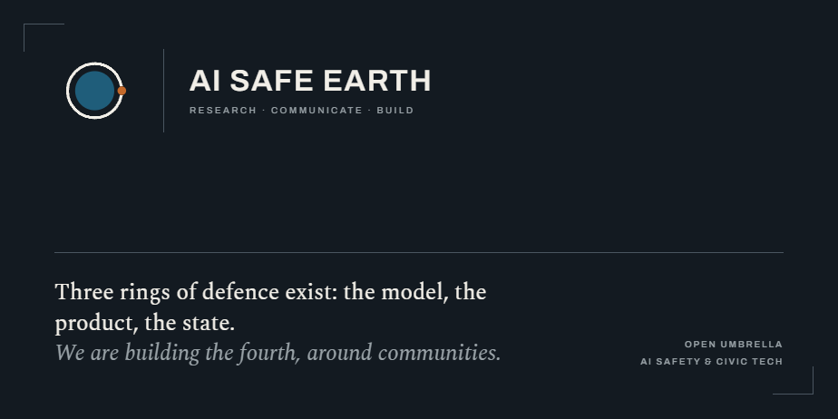

## AI safety integral strategy and civic tech

**Social infrastructure is critical infrastructure.**
**AI safety begins where humans meet.**
**At AI SAFE EARTH, we ACT.**

AI SAFE EARTH was born as a response to digital imbalance, under one critical assumption: as digital systems grow more intelligent, that imbalance amplifies disruptive social risks. We are an open umbrella for people who don't just theorize about this, they build, research, and communicate to change it. AI SAFE EARTH is open to any ethical AI initiative and ready to pivot if the times require it.

We are aware that the digital layer grows thicker every day. We refuse to remain passive while this unfolds. So we think critically, take a position, and above all, we act.

---

## The problem we refuse to ignore

A digital intermediate layer is thickening between human connections, and the models and agents that manage those connections are becoming more powerful every day. When a single layer mediates how people talk, decide, and relate, whoever controls it gains outsized power, and communities lose agency.

The risk is not a distant superintelligence. It has already begun: the slow erosion of human agency and power concentration.

Some forecasts put transformative AI in years, not decades. We may be unprepared for the effects, and we cannot wait for perfect research or perfect policy. So we treat social infrastructure the way we treat a power grid, as critical infrastructure to be protected and strengthened, urgently, before digital imbalance and advanced AI combine into something we cannot undo.

---

AI SAFE EARTH organizes its work in three pillars: **Research**, **Communicate**, and **Build**. Each is an open umbrella: the projects listed below are where we start, not where we stop. New initiatives that share our values are welcome in any of them.

---

## RESEARCH

We study AI safety with an integral approach focused on resilient systems or vulnerable ones to the erosion of human agency.

### [AI Safe Territory](https://github.com/ai-safe-earth/AI-Safe-Territory) *(in progress)*

     

Research into AI-safe towns and cities, and a transparent, reproducible evaluation system that scores and ranks territories on their resilience: distributed decision-making, redundant communication channels (no single point of dependence), local ownership, civic density, AI literacy, and exposure to capture.

The living book is published and evolving: [living book](https://ai-safe-earth.github.io/AI-Safe-Territory/)

---

## COMMUNICATE

We turn research into pressure. Using data, real examples, and red-teaming scenarios, we build critical mass and move decision-makers to act accordingly. We identify the gaps between AI risks and people's awareness of them, and we create materials for effective AI-safety literacy.

### AI Safety Territory Articles *(in progress)*

Articles and other communication materials extracted from the AI Safe Territory research.

### AI Safe Earth Map *(in progress)*

An interactive map that makes the territorial rankings legible, comparable, and public.

### AI Safety for Community Leaders *(in progress)*

Practical, accessible learning materials directed at the local leaders who hold communities together.

---

## BUILD

This is the action arm. We build safe apps to rebalance digital and physical social interaction, reinforce local communities and social dynamics, and return data ownership to people. Physical and local networks are the safety net, social infrastructure is a critical infrastructure. We build to make it stronger, fast, before AGI or malicious actors using AI, and digital imbalance create a critical combination. Alongside this, we develop technical research and applications on safety layers.

Two main strategies lead the AI SAFE EARTH building arm:
1 build to enhance social infrastructure and promote physical interactions.
2 build to decrease digital dependency, to make AI products safer, to avoid an intermediate AI layer between humans, and to increase misinformation awareness.

### Civic Tech Applications

#### [laiive](https://github.com/ai-safe-earth/laiive/tree/main)

     
  
The first project under the AI SAFE EARTH umbrella. Some of the services built behind laiive are being developed as project-agnostic, so they can be used by other projects to extend AI SAFE EARTH's values.

#### [get-out-door](https://github.com/ai-safe-earth/get-out-door)

     

A multi-hop adventure chatbot. Developed as project-agnostic so it can be reused across the AI SAFE EARTH umbrella. Connects people with trails, hikes, and outdoor routes through a knowledge graph that answers complex natural-language queries, pulling users away from the screen and into the physical world.

---

### Open-source packages / Skills / Others

#### [AI Safety Guardrails](https://github.com/ai-safe-earth/AI-Safety-Guardrails)

     

A modular package that adds layered protection around LLM applications across the full lifecycle of a request. It applies safety checks at four stages: input, processing/tool calls, output, and policy/compliance. The mission is to reduce risks like PII leakage, prompt injection, unsafe tool use, and harmful responses before they reach users. Its relevance is in this defense-in-depth design: each layer catches different failure modes, while audit logging and compliance modules (EU AI Act, NIST AI RMF) provide traceability and governance for real-world deployment.

#### [UDO Recommender System](https://github.com/ai-safe-earth/UDO)

     
  
UDO stands for User Data Ownership. No black box manipulates users: they are aware of what they share or privately use to feed the recommender system, and can delete or modify it at any time.

---

## How we do think civic tech and apply AI

We turn the algorithmic loop into a bridge toward real life. AI is used not as an addictive form of interaction, but to bring people back to people, pulling users out of infinite scrolling and dopamine drain and into face-to-face socialization and public life. We return data ownership to users and ensure its security to prevent deep manipulation.

---

## Why

Because it is too risky to rely on a digital network whose control could be captured.
Because AI safety begins where humans meet.

---

## Core values

### At AI SAFE EARTH, we:

- Use AI to reconnect, not to trap.
- Understand physical networks and communities as a resilience layer for a healthy system.
- Keep humans, cultures, and communities at the center.

### We don't:

- Build artificial companions.
- Optimize for engagement or addiction.
- Replace real relationships with simulation.
- Sell people's lives or intimacies in any data format.

We build tools for balance, not distraction.

---

## White paper

A white paper is in progress to ground these ideas in data, research, and methodology: **[AI SAFE EARTH White Paper](https://github.com/ai-safe-earth/whitepaper)**. Until then: prototype, connect, and share.

---

## Contribute

New initiatives that share our values are welcome in any of the three pillars. Start with [contributing](./contributing.md).

---

AI SAFE EARTH · an open umbrella · the fourth ring, around communities · AI safety &amp; civic tech · <a href="https://github.com/ai-safe-earth">github.com/ai-safe-earth</a>
